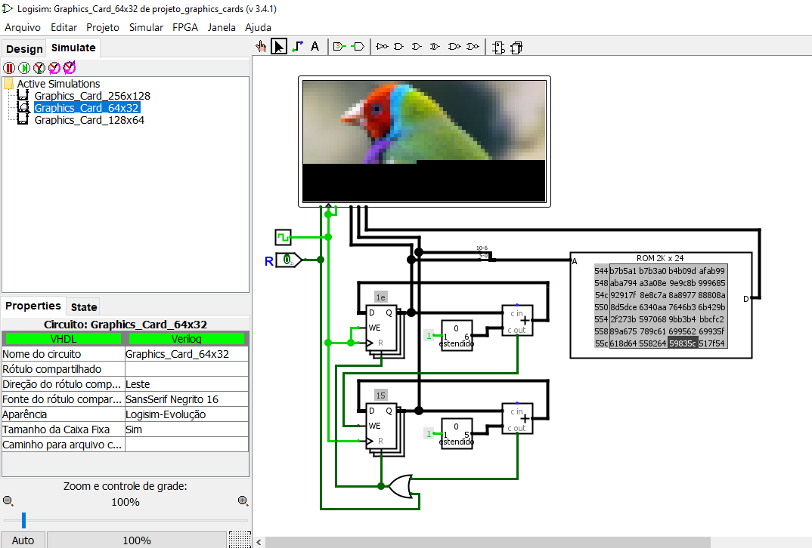

# Projeto Graphics Card 

<blockquote>
<p><em>Projeto de circuitos de placas gráficas ao nível de portas lógicas, realizado utilizando o simulador de lógica digital Logisim Evolution 3.4.1.</em></p>
</blockquote>  

<p align="center">
    
</p>

## Execução
Para a execução deste projeto utilize o programa <a href="https://github.com/reds-heig/logisim-evolution">Logisim Evolution 3.4.1</a>.

## Como executar ?
Abra o Logsim Evolution e divirta-se! Para adicionar uma imagem siga os passos abaixo:

```
        - Ajuste a resolução da imagem para a resolução do display
        - A imagem deve ser um PNG
        - Utilize o programa convert.py para converter a imagem    
        - Agora basta carreaga os dados para ROM usando o formato v3.0 hex
```
